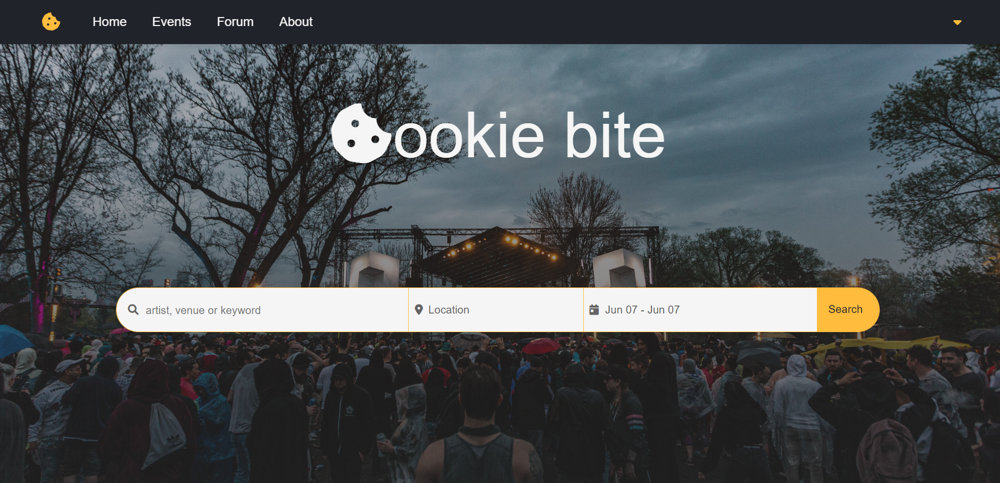
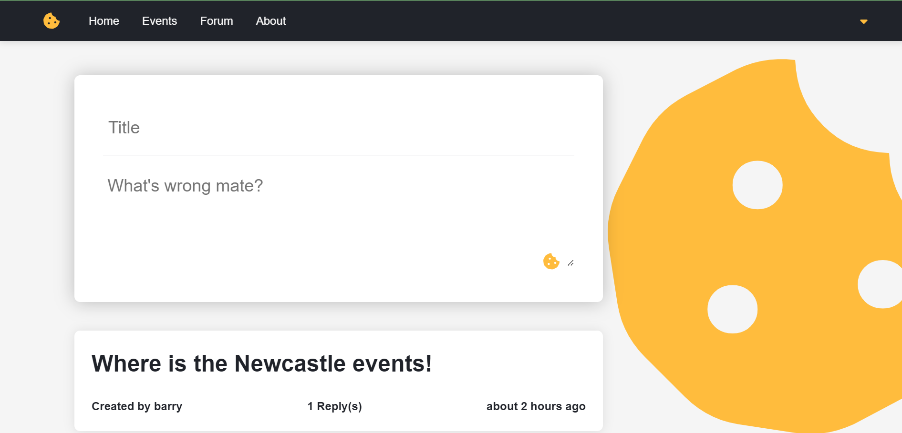
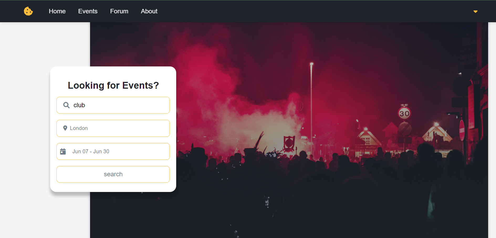
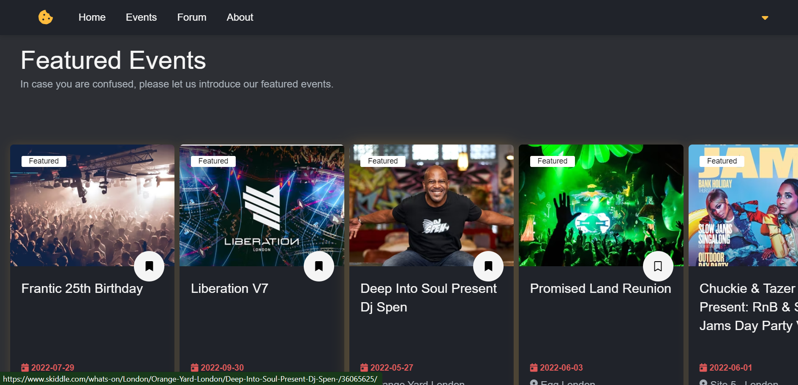
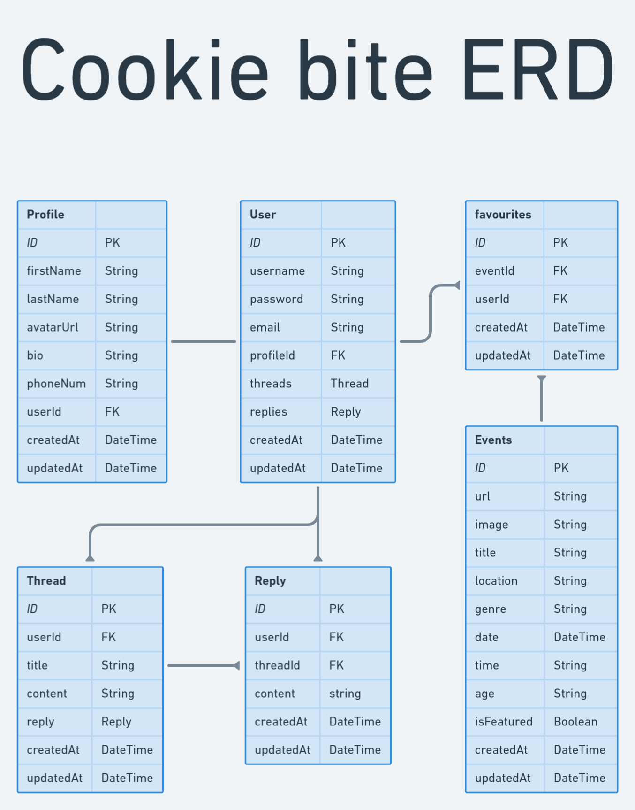

# Cookie bite

## Project Description

Welcome to Cookie bite. A website where all can venture onto a single platform to access multiple events across the United Kingdom.

This application was firstly inspired due to having so many links open on a web browser to find a single suited event which made me think all events can be compressed onto a single web application.

Once you open Cookie bite, you will be directed to the home page where the user will be presented with a navigation bar that can then redirect the user to various pages that include "Home", "Events", "About", a "Forum", and on the main section of the page, the user will then be presented to a search box where s/he can apply various keywords, followed by required dates to the users suited event.

The user can also have an option to sign in or sign up to Cookie bite where s/he can make an account and interact with other users of the application on the "Forum" page. This is a great way to share interests and gain exposure to attending events with like-minded people from Cookie bite.

The fun does not stop there... scientific studies show that screen users may have sensitive eyes, so we have enhanced the web application by adding an optional dark mode to the theme of Cookie bite during long periods of visiting the site.

Also, we have introduced a section where the user can save events they may be interested in attending with a single click on a bookmark icon where data will be stored on an accessible database that when Cookie bite updates its latest events by scraping, will not be affected by losing any data the user has stored on his/her account.

## Setup instructions

1. Fork this repository or just clone it, it is up to you!
2. Rename `.env.template` to `.env`
3. The `REACT_APP_API_URL` variable in `.env` is talking to the deployed API, or replace it with `http://localhost:(someport)` in case you wanna develop the API.
4. Run `npm ci` to install the project dependencies.
5. Run `npm start` to run the dev mode.

## Links

[Cookie bite](https://cookie-bite.netlify.app/)
[The server repo](https://github.com/alsyoufomar/solo-project-server-Cookie-bite)

## Stack used

- Front-end: Javascript, React, HTML, CSS
- Back-end: Node.js, Express.js, Prisma, PostgreSQL 

## Diagrams

.png>)
.png>)
.png>)
.png>)
.png>)

## Learnings

- Setting up a wireframe for the website beforehand is super helpful.
- Web scraper is helpful for building your own API.
- React.js and Express.js are super fun to work with.
